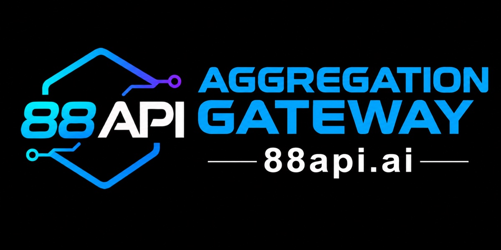

<div align="center">

# CC Switch

### Der All-in-One-Manager für Claude Code, Claude Desktop, Codex, Gemini CLI, Grok Build, OpenCode, OpenClaw, Hermes Agent, Pi & MiniMax Code

**API-Anbieter mit einem Klick wechseln und MCP, Skills und Prompts zentral verwalten — ohne JSON-, TOML- oder YAML-Konfigurationsdateien von Hand zu bearbeiten.**

[](https://github.com/farion1231/cc-switch/releases)
[](https://github.com/farion1231/cc-switch/releases)
[](https://tauri.app/)
[](https://github.com/farion1231/cc-switch/releases/latest)

<a href="https://trendshift.io/repositories/15372" target="_blank"></a>
<a href="https://www.star-history.com/#farion1231/cc-switch&Date"><picture><source media="(prefers-color-scheme: dark)" srcset="https://api.star-history.com/badge?repo=farion1231/cc-switch&theme=dark" /></picture></a>

### 🌐 Die einzige offizielle Website: **[ccswitch.io](https://ccswitch.io)**

[English](README.md) | [中文](README_ZH.md) | [日本語](README_JA.md) | Deutsch | [Changelog](CHANGELOG.md)

**[Download](#download--installation) · [Schnellstart](#schnellstart) · [Funktionen](#funktionen) · [FAQ](#faq) · [Benutzerhandbuch (Englisch)](docs/user-manual/en/README.md)**

</div>

## ❤️Sponsoren

> [Möchten Sie hier erscheinen?](mailto:support@ccswitch.io)

<details open>
<summary>Zum Einklappen klicken</summary>

[](https://platform.kimi.ai?track_id=track-674ed6e2af924a5682a87421f7cf753a&aff=cc-switch)

Kimi K3 ist das bislang leistungsstärkste Modell von Moonshot AI und das weltweit erste offene Modell der 3T-Klasse. Mit 2,8 Billionen Parametern, nativen visuellen Fähigkeiten und einem Kontextfenster von 1 Million Token liefert K3 Spitzenleistung bei langfristigen Programmieraufgaben, Wissensarbeit und Reasoning. Mit CC Switch lässt sich Kimi in den verschiedensten Agenten-Tools bequem konfigurieren und umschalten.

Arbeiten Sie hauptsächlich mit Programmierung? Probieren Sie einen **Kimi Code Tarif** ([中文站](https://www.kimi.com/code?aff=cc-switch) | [Global](https://www.kimi.ai/code?aff=cc-switch)) aus, oder nutzen Sie die **API** über die Kimi Open Platform ([中文站](https://platform.kimi.com?track_id=track-7cf2b91dcde043eda6ef9a95951a042c&aff=cc-switch) | [Global](https://platform.kimi.ai?track_id=track-674ed6e2af924a5682a87421f7cf753a&aff=cc-switch)).

**Bonus für die erste Aufladung neuer Nutzer**: Registrieren Sie sich über die obigen API-Links und schließen Sie Ihre erste Aufladung ab, um 10 % des Betrags als Bonus-API-Guthaben zu erhalten – bis zu CNY ¥1.000.

---

<table>
<tr>
<td width="180"><a href="https://www.packyapi.ai/register?aff=cc-switch"></a></td>
<td>Danke an PackyCode für die Unterstützung dieses Projekts! PackyCode ist ein zuverlässiger und effizienter API-Relay-Anbieter, der Relay-Dienste für Claude Code, Codex, Gemini und mehr bereitstellt. PackyCode bietet Sonderrabatte für Nutzer unserer Software: Registrieren Sie sich über <a href="https://www.packyapi.ai/register?aff=cc-switch">diesen Link</a> und geben Sie beim ersten Aufladen den Gutscheincode „cc-switch" ein, um 10 % Rabatt zu erhalten.</td>
</tr>

<tr>
<td width="180"><a href="https://zetaapi.ai/go/u117"></a></td>
<td>Danke an ZetaAPI für die Unterstützung dieses Projekts! ZetaAPI legt den Fokus auf echte Modelltreue — keine verwässerten Antworten, keine Qualitätsminderung — und Preise von nur 35 % der offiziellen Tarife. Die Plattform mischt keinen Traffic, ersetzt Modelle nicht heimlich durch minderwertige Alternativen und nutzt kein gefälschtes Modell-Routing. Sie unterstützt Claude Code, Codex, Gemini, ChatGPT und weitere gängige KI-Modelle und hilft Nutzern, die API-Kosten deutlich zu senken und gleichzeitig eine zuverlässige Modellqualität zu gewährleisten. Gleichzeitig bietet ZetaAPI eine SLA-gestützte Stabilität auf Unternehmensniveau, Standard-API-Kompatibilität, einen API-Key für mehrere Modelle, schnelle Integration und nutzungsbasierte Abrechnung — geeignet für KI-Produkte, Coding-Agents, interne Unternehmenstools, Kundenservice-Systeme, Content-Erstellung und Automatisierungs-Workflows. Falls bei einem Modell nachgewiesen wird, dass es nicht der angegebenen Qualität entspricht, sichert ZetaAPI dies mit einer 10-fachen Entschädigungsgarantie ab und bietet Nutzern ein stabileres, transparenteres und vertrauenswürdigeres Erlebnis. Registrieren Sie sich über <a href="https://zetaapi.ai/go/u117">diesen Link</a> und verwenden Sie bei Ihrer ersten Aufladung den Promo-Code CC-SWITCH, um als CC-Switch-Nutzer einen exklusiven Rabatt von 10 % auf Ihre erste Aufladung zu erhalten!</td>
</tr>

<tr>
<td width="180"><a href="https://apinebula.ai/VjM74M"></a></td>
<td>Danke an APINEBULA für die Unterstützung dieses Projekts! APINEBULA ist eine Enterprise-KI-Aggregationsplattform unter Galaxy Video Bureau und nutzt umfangreiche Plattformressourcen, um Entwicklern, Teams und Unternehmen stabilen und kosteneffizienten Zugang zu APIs großer Sprachmodelle zu bieten. Die Plattform bündelt führende vollwertige Modelle wie Claude, GPT und Gemini. Über eine einzige API erhalten Sie Zugriff auf weltweit führende KI-Modelle, mit Preisen ab 10 % des Originalpreises. APINEBULA ist für KI-Programmierung, Agent-Entwicklung und Integration in Geschäftssysteme ausgelegt und unterstützt enterprise-grade hohe Parallelität, formale Verträge, Firmenüberweisungen und Rechnungsstellung. APINEBULA bietet Nutzern dieser Software besondere Rabatte: Registrieren Sie sich über <a href="https://apinebula.ai/VjM74M">diesen Link</a> und geben Sie beim ersten Aufladen den Aktionscode <strong>"ccswitch"</strong> ein, um <strong>10 % Rabatt</strong> zu erhalten.</td>
</tr>

<tr>
<td width="180"><a href="https://www.aicodemirror.ai/register?invitecode=9915W3"></a></td>
<td>Danke an AICodeMirror für die Unterstützung dieses Projekts! AICodeMirror stellt offizielle, hochstabile Relay-Dienste für Claude Code / Codex / Gemini CLI bereit, mit unternehmensgerechter Nebenläufigkeit, schneller Rechnungsstellung und rund um die Uhr verfügbarem dediziertem technischem Support.
Offizielle Kanäle von Claude Code / Codex / Gemini zu 38 % / 2 % / 9 % des Originalpreises, mit zusätzlichen Rabatten beim Aufladen! AICodeMirror bietet besondere Vorteile für CC-Switch-Nutzer: Registrieren Sie sich über <a href="https://www.aicodemirror.ai/register?invitecode=9915W3">diesen Link</a> und erhalten Sie 20 % Rabatt auf Ihre erste Aufladung; Unternehmenskunden erhalten bis zu 25 % Rabatt!</td>
</tr>

<tr>
<td width="180"><a href="https://pateway.ai/?ch=etzpm8&aff=WB6M6F67#/"></a></td>
<td>Danke an PatewayAI für die Unterstützung dieses Projekts! PatewayAI ist ein API-Relay-Anbieter für anspruchsvolle KI-Entwickler, der sich auf das direkte Relayen offizieller hochwertiger Modell-APIs konzentriert. Er bietet die komplette Claude-Reihe und die Codex-Serie, zu 100 % aus offiziellen Kanälen bezogen — keine Verwässerung, keine Fälschungen, Überprüfung ausdrücklich erwünscht. Die Abrechnung ist transparent, und jede Rechnung auf Token-Ebene lässt sich Zeile für Zeile prüfen.
Er unterstützt zudem unternehmensgerechte Nebenläufigkeit und stellt Unternehmenskunden eine dedizierte Verwaltungsplattform bereit — formelle Verträge und Rechnungsstellung sind verfügbar; Kontaktdaten finden Sie auf der offiziellen Website.
Registrieren Sie sich jetzt über <a href="https://pateway.ai/?ch=etzpm8&aff=WB6M6F67#/">diesen Link</a> und erhalten Sie ein Testguthaben von 3 $. Aufladungen sind ab 60 % des Originalpreises möglich, mit einem beidseitigen Empfehlungsbonus von bis zu 150 $!</td>
</tr>

<tr>
<td width="180"><a href="https://api.fenno.ai/register?redirect=/purchase?tab=subscription%26group=16&aff=P9MR3D3PLCNL"></a></td>
<td>Danke an Fenno.ai für die Unterstützung dieses Projekts! Fenno.ai ist ein stabiler und effizienter API-Relay-Dienstleister, der sich derzeit hauptsächlich auf Codex-Relay konzentriert. Er ist mit den OpenAI- und Anthropic-Protokollen kompatibel und lässt sich flexibel mit Codex, Claude Code, OpenCode und anderen gängigen Coding-Tools nutzen. Er unterstützt zuverlässig Workloads auf Unternehmensniveau von Hunderten Milliarden Tokens pro Tag und bietet B2B-Abrechnung sowie Rechnungsstellung für Unternehmen im In- und Ausland. Fenno.ai bietet einen exklusiven Vorteil für CC-Switch-Nutzer: Abonnieren Sie über <a href="https://api.fenno.ai/register?redirect=/purchase?tab=subscription%26group=16&aff=P9MR3D3PLCNL">diesen Link</a> den $1,99-Trial-Plan im Wert von $50 Guthaben (7 Tage gültig) und erhalten Sie bis zu 20% Empfehlungsprämien — je mehr Einladungen, desto mehr Belohnung!</td>
</tr>

<tr>
<td width="180"><a href="https://runapi.host/register?aff=iOKB"></a></td>
<td>Danke an RunAPI für die Unterstützung dieses Projekts! RunAPI ist ein leistungsstarkes und zuverlässiges KI-Modell-API-Gateway — ein API-Schlüssel gibt Ihnen Zugriff auf mehr als 150 gängige Modelle, darunter OpenAI, Claude, Gemini, DeepSeek und Grok, zu Preisen ab 10 % des offiziellen Tarifs und mit ausgezeichneter Stabilität. Es arbeitet nahtlos mit Claude Code, OpenClaw und weiteren Werkzeugen zusammen. Exklusiver Vorteil für CC-Switch-Nutzer: Registrieren Sie sich über <a href="https://runapi.host/register?aff=iOKB">diesen Link</a> und erhalten Sie 10 % Rabatt auf Ihre erste Aufladung!</td>
</tr>

<tr>
<td width="180"><a href="https://www.shengsuanyun.com/?from=CH_4HHXMRYF"></a></td>
<td>Danke an Shengsuanyun für die Unterstützung dieses Projekts! Shengsuanyun ist eine Superfabrik für KI-native Teams — eine Plattform zur parallelen Ausführung von KI-Aufgaben in industrieller Qualität. Ihr Modellmarktplatz bündelt die Fähigkeiten von Claude, ChatGPT, Gemini und weiteren in- und ausländischen LLM- und Multimedia-Modellen mit Direktbezug. Absolut kein Reverse Engineering und keine Verwässerung — die plattformweite Modell-SLA-Verfügbarkeit erreicht 99,7 %, und die <a href="https://watch.shengsuanyun.com/status/shengsuanyun">Monitoring-Dashboards</a> zeigen durchgehend grün an. Es bietet außerdem unternehmensgerechte, anpassbare Gateways für fein abgestufte Kosten- und Berechtigungsverwaltung im Team, intelligentes Routing, Sicherheitsschutz und BYOK-Hosting (Bring Your Own Key). Die Plattform rechnet nach Nutzung sowie über einen Token-Plan (in Kürze verfügbar) ab, und Rechnungsstellung ist möglich. Registrieren Sie sich über <a href="https://www.shengsuanyun.com/?from=CH_4HHXMRYF">diesen Link</a> als Neukunde und erhalten Sie ein Guthaben von ¥10 sowie 10 % Bonus auf Ihre erste Aufladung.</td>
</tr>

<tr>
<td width="180"><a href="https://aigocode.app/invite/CC-SWITCH"></a></td>
<td>Danke an AIGoCode für die Unterstützung dieses Projekts! AIGoCode ist eine All-in-One-Plattform, die Claude Code, Codex und die neuesten Gemini-Modelle integriert und Ihnen stabile, effiziente und äußerst kostengünstige KI-Coding-Dienste bietet. Die Plattform stellt flexible Abonnementpläne bereit, birgt kein Risiko einer Kontosperrung, ermöglicht Direktzugriff ohne VPN und reagiert blitzschnell. AIGoCode hat ein besonderes Angebot für CC-Switch-Nutzer vorbereitet: Wenn Sie sich über <a href="https://aigocode.app/invite/CC-SWITCH">diesen Link</a> registrieren, erhalten Sie bei Ihrer ersten Aufladung zusätzliche 10 % Bonusguthaben!</td>
</tr>

<tr>
<td width="180"><a href="https://aicoding.inc/i/CCSWITCH"></a></td>
<td>Danke an AICoding für die Unterstützung dieses Projekts! AICoding — globaler AI-Modell-API-Relay-Dienst zu unschlagbaren Preisen! Claude Code für 19 % des Originalpreises, GPT für nur 1 %! Hunderte Unternehmen vertrauen auf diese kostengünstigen KI-Dienste. Unterstützt Claude Code, GPT, Gemini und führende chinesische Modelle — mit hoher Parallelität auf Unternehmensniveau, schneller Rechnungsstellung und persönlichem technischem Support rund um die Uhr. CC-Switch-Nutzer, die sich über <a href="https://aicoding.inc/i/CCSWITCH">diesen Link</a> registrieren, erhalten 10 % Rabatt auf ihre erste Aufladung!</td>
</tr>

<tr>
<td width="180"><a href="https://subrouter.ai/register?aff=l3ri"></a></td>
<td>Danke an SubRouter für die Unterstützung dieses Projekts! SubRouter ist ein Marktplatz und eine intelligente Routing-Plattform für Betreiber von KI-Diensten. Händler können eigene Betriebsseiten starten, Pakete veröffentlichen sowie Nutzer, Modelle und Preise verwalten, während Nutzer im Marktplatz Dienste entdecken und über eine einzige einheitliche API zuverlässige und effiziente Modellaufrufe nutzen. Registrieren Sie sich über <a href="https://subrouter.ai/register?aff=l3ri">diesen Link</a>!</td>
</tr>

<tr>
<td width="180"><a href="https://agentmarket.fluxapay.xyz/marketplace/tokenplans"></a></td>
<td>Danke an FluxA &amp; Baidu AI Cloud für die Unterstützung dieses Projekts! FluxA und Baidu AI Cloud haben gemeinsam AgenticPlan gestartet: KI-Agenten erhalten damit die Fähigkeit, Modelle, APIs und Werkzeuge eigenständig zu kaufen, zu verwalten und zu nutzen. Enthalten ist der Baidu-Qianfan-TokenPlan mit bis zu 40 % Rabatt und Zugriff auf Spitzenmodelle wie DeepSeek V4, GLM 5.2 und Kimi. Dazu kommt Guthaben für die APIs des FluxA AgentMarket, das mehr als 13.000 kostenpflichtige APIs freischaltet – für Suche, Daten-Scraping, soziale Medien, Finanzen, Krypto, Bildgenerierung, Video und mehr.<br>Mit Zustimmung der Nutzerinnen und Nutzer kann ein KI-Agent außerdem mit der offiziellen Visa-Karte bezahlen, um selbstständig Ressourcen zu beschaffen, API-Schlüssel zu verwalten, die Nutzung zu überwachen und Verlängerungen zu planen. So entwickelt sich der Agent von „Aufgaben eigenständig erledigen“ zu „eigenständig Budgets planen und Aufgaben erledigen“. Kaufen Sie über <a href="https://agentmarket.fluxapay.xyz/marketplace/tokenplans">diesen Link</a>!</td>
</tr>

<tr>
<td width="180"><a href="https://88api.ai/sign-up?aff=HSGY"></a></td>
<td>Danke an die 88API Token-Aggregationsplattform für die Unterstützung dieses Projekts! 88API ist eine von einem Hongkonger Unternehmen betriebene All-in-one-Multi-Modell-API-Plattform, die sich vor allem an Entwickler, Kreative und Nutzer von KI-Anwendungen richtet. Über eine einheitliche Schnittstelle erhalten Sie Zugriff auf Text-, Bild-, Sprach- und Videomodelle – für gängige Workflows wie KI-Programmierung, intelligente Übersetzung, Content-Erstellung, Vertonung, Bild- und Videogenerierung. Der Anbieter lässt sich direkt in CC Switch hinzufügen und umschalten. 88API unterstützt die gängigen internationalen Zahlungsmethoden, kann Rechnungen ausstellen und bietet stabilen Service auf Enterprise-Niveau. Registrieren Sie sich über <a href="https://88api.ai/sign-up?aff=HSGY">diesen Link</a>, um exklusives Bonusguthaben zu erhalten!</td>
</tr>

<tr>
<td width="180"><a href="https://apikey.fan/register?aff=CCSwitch"></a></td>
<td>Danke an APIKEY.FUN für die Unterstützung dieses Projekts! APIKEY.FUN ist eine professionelle KI-Relay-Plattform auf Enterprise-Niveau, die Unternehmen und einzelnen Entwicklern stabilen, effizienten und kostengünstigen Zugriff auf KI-Modell-APIs bietet. Die Plattform unterstützt beliebte Mainstream-Modelle wie Claude, OpenAI und Gemini, mit Preisen ab 7 % der offiziellen Tarife. Wer sich über den <a href="https://apikey.fan/register?aff=CCSwitch">exklusiven Link</a> dieses Projekts registriert, kann ein exklusives Angebot von bis zu <strong>dauerhaft 5 % Rabatt auf Aufladungen</strong> erhalten.</td>
</tr>

<tr>
<td width="180"><a href="https://9527.codes/register?aff=e5zI"></a></td>
<td>Danke an 9527CODE für die Unterstützung dieses Projekts! 9527 CODE ist eine KI-Relay-Plattform auf Enterprise-Niveau mit vollem Funktionsumfang, die auf Stabilität und Servicequalität ausgerichtet ist und für Claude Code, Codex und andere gängige KI-Modelle schnelle, stabile und hochwertige Relay-Dienste bereitstellt. Besonderer Wert liegt auf langfristiger Stabilität, Leitungsqualität und dauerhafter Verfügbarkeit, um Unternehmen und intensiven KI-Nutzern eine stabile, effiziente All-in-one-Lösung für den Modellzugriff zu bieten. Seit einem Jahr im Dauerbetrieb, mit 99,9 % Servicestabilität und technischem Support rund um die Uhr (7×24) durch echte Mitarbeiter. Wer sich über den <a href="https://9527.codes/register?aff=e5zI">exklusiven Link</a> dieses Projekts registriert, erhält als Neukunde nach Kontaktaufnahme mit dem Kundenservice ein Testguthaben; die Empfehlungsprämie ist unbegrenzt!</td>
</tr>

<tr>
<td width="180"><a href="https://console.apito.ai/agent/register/pQBql2buaqiX3dDS"></a></td>
<td>Dieses Projekt wird von <a href="https://console.apito.ai/agent/register/pQBql2buaqiX3dDS">Claude API</a> gesponsert. Direkter Claude-API-Zugriff — verbinden Sie Claude Code und Agent-Apps in 3 Minuten. Neukunden können ein kostenloses Testguthaben einlösen. Betrieben mit offiziellen Anthropic-API-Schlüsseln + offiziellen AWS-Bedrock-Kanälen. Kein Reverse Engineering, keine Modellverschlechterung. Volle Unterstützung der Modellreihe Opus / Sonnet / Haiku, mit erhaltenen offiziellen Fähigkeiten einschließlich Tool Use, 1M-Kontextfenster und mehr. Entwickelt für Claude-Code-Power-User, Agent-Ingenieure und technische Unternehmensteams. Rechnungsstellung und dedizierter Team-Support verfügbar. Klicken Sie <a href="https://console.apito.ai/agent/register/pQBql2buaqiX3dDS">hier</a>, um sich zu registrieren!</td>
</tr>

<tr>
<td width="180"><a href="https://code0.ai/agent/register/B2XHxGjGmRvqgznY"></a></td>
<td>Vielen Dank an <a href="https://code0.ai/agent/register/B2XHxGjGmRvqgznY">code0.ai</a> für die Unterstützung dieses Projekts! code0.ai ist eine für Entwickler entwickelte AI-Coding-Service-Plattform, die Claude Code, Codex, Gemini und weitere gängige AI-Coding-Funktionen unterstützt. Sie hilft einzelnen Entwicklern und Teams, AI-Agents stabiler und effizienter für Programmierung, Debugging, Refactoring und Automatisierungs-Workflows zu nutzen. ccswitch-Nutzer können über die <a href="https://code0.ai/agent/register/B2XHxGjGmRvqgznY">code0.ai-Website</a> den Kundensupport kontaktieren, um Testguthaben zu erhalten und einen zuverlässigen AI-Coding-Service zu erleben.</td>
</tr>

<tr>
<td width="180"><a href="https://teamorouter.cn/?utm_source=cc_switch&utm_medium=referral&utm_campaign=ai_directory"></a></td>
<td>Danke an TeamoRouter für die Unterstützung dieses Projekts! TeamoRouter ist ein Agentic-LLM-Gateway in Enterprise-Qualität, das für Entwickler, KI-Teams und Unternehmen entwickelt wurde. Ganz ohne Abonnement können Sie über eine einzige einheitliche API auf Claude Code, Codex, Gemini CLI, OpenAI Codex und weitere beliebte KI-Agenten zugreifen — bei API-Preisen mit Rabatten von bis zu 90 %.
Anders als typische API-Relay-Dienste bündelt TeamoRouter Hunderte offizieller Modellanbieter und vertrauenswürdiger Infrastrukturpartner, darunter OpenAI, Anthropic, Vertex, Azure und AWS Bedrock. Jeder Anbieter wird auf 100%ige Kompatibilität mit dem Agent-Protokoll, Cache-Performance und Nachverfolgbarkeit von Anfragen geprüft und liefert so stabile Qualität statt reverse-engineerter oder verwässerter Endpunkte. Die Plattform bietet nahezu offizielle TTFT, 99,6 % SLA, Durchsatz in Unternehmensgröße von bis zu 5.000 QPM und branchenführende Cache-Trefferquoten, die die Token-Kosten für langlaufende Agent-Workflows drastisch senken.
TeamoRouter bietet außerdem Enterprise-Funktionen wie zentrale Abrechnung, Team-Verwaltung, BYOK, intelligentes Routing, Nutzungsanalysen, dynamische Anbieter-Optimierung und dedizierten Support. Für ein noch einfacheres Erlebnis können Sie mit Teamo Desktop Claude Code, Codex, Gemini CLI und weitere beliebte KI-Agenten per Ein-Klick-Einrichtung nutzen — ohne Verwaltung von API-Schlüsseln oder manuelle Gateway-Konfiguration. Registrieren Sie sich als neuer Nutzer über <a href="https://teamorouter.cn/?utm_source=cc_switch&utm_medium=referral&utm_campaign=ai_directory">diesen Link</a> und erhalten Sie 10 % Rabatt auf Ihre erste Aufladung.</td>
</tr>

<tr>
<td width="180"><a href="https://ppio.com/activity/ccswitch"></a></td>
<td>Danke an PPIO für die Unterstützung dieses Projekts! PPIO ist ein führender unabhängiger Agentic-Cloud-Anbieter in China, 2018 gegründet von PPTV-Gründer Yao Xin und dem früheren PPTV-Chefarchitekten Wang Wenyu. Mit einem einzigen API-Schlüssel erhalten Sie Zugriff auf sämtliche führenden Open-Source-Modelle, darunter DeepSeek-V4-Flash, Kimi-K3, GLM-5.2 und MiniMax-M3; der Token Plan für Unternehmen ist mit bis zu 40 % Rabatt und bis zu 200 Sitzplätzen verfügbar, und das Fusion-Modell erreicht das Niveau von Fable5 zu einem Zehntel des Preises. Registrieren Sie sich über <a href="https://ppio.com/activity/ccswitch">diesen Link</a> und schließen Sie die Identitätsprüfung ab, um einen Gutschein über ¥10 zu erhalten. Wer Freunde einlädt, erhält bis zu 15 % Cashback auf deren Aufladungen.</td>
</tr>

<tr>
<td width="180"><a href="https://www.newapi.ai/"></a></td>
<td>Vielen Dank an das Open-Source-KI-Infrastrukturprojekt <a href="https://www.newapi.ai/">new-api</a> für die tatkräftige Unterstützung dieses Projekts! new-api ist ein Open-Source-KI-Infrastrukturprojekt von QuantumNous und eines der nach Aktivität und Verbreitung führenden Projekte für den einheitlichen Zugang zu und die Verteilung von LLMs, das sich darauf konzentriert, Entwicklern, Teams und Unternehmen beim Aufbau verwaltbarer und skalierbarer KI-Serviceplattformen zu geringeren Kosten zu helfen. Als ein ebenfalls im Open-Source-Ökosystem verwurzeltes Projekt möchte new-api durch Sponsoring die kontinuierliche Weiterentwicklung weiterer herausragender Open-Source-Projekte unterstützen. 🌟 Unterstützen Sie new-api mit einem Star: <a href="https://github.com/QuantumNous/new-api">https://github.com/QuantumNous/new-api</a>. Website: <a href="https://www.newapi.ai/">https://www.newapi.ai/</a>.</td>
</tr>

<tr>
<td width="180"><a href="https://claudecn.ai/register?aff=HEL9"></a></td>
<td>Danke an ClaudeCN für die Unterstützung dieses Projekts! ClaudeCN ist eine unternehmensgerechte KI-Gateway-Plattform, die von einem eingetragenen Unternehmen betrieben wird. Sie bietet hochverfügbaren kommerziellen API-Zugriff auf beliebte Modelle wie Claude, GPT und DeepSeek und ist auf formelle Unternehmensbeschaffungsprozesse ausgerichtet — Banküberweisungen von Firmen, unterzeichnete Verträge und volle Compliance. Registrieren Sie sich über <a href="https://claudecn.ai/register?aff=HEL9">diesen Link</a>!</td>
</tr>

<tr>
<td width="180"><a href="https://www.byteplus.com/en/product/modelark?utm_campaign=hw&utm_content=ccswitch&utm_medium=devrel_tool_web&utm_source=OWO&utm_term=ccswitch"></a></td>
<td>Danke an Dola seed für die Unterstützung dieses Projekts! Dola Seed 2.0 ist ein voll-modales Allzweck-Großmodell, das von ByteDance eigenständig für den globalen Markt entwickelt wurde. Aufbauend auf einer einheitlichen multimodalen Architektur unterstützt es das gemeinsame Verstehen und Generieren von Text, Bildern, Audio und Video. Es ermöglicht von Haus aus die Zusammenarbeit von Agenten und verfügt über starke Fähigkeiten in den Bereichen Schlussfolgern, Ausführung langer Aufgaben, Werkzeugintegration und Programmierung. Es ist breit einsetzbar — etwa für intelligente Cockpits, persönliche Assistenten, Bildung, Kundensupport, Marketing, Einzelhandel und weitere Szenarien. Es überzeugt bei multimodaler Wahrnehmung, der Ende-zu-Ende-Bewältigung komplexer Aufgaben, stabiler Interaktion und Datensicherheit und ist über die ModelArk-Plattform einfach zugänglich und bereitstellbar. Registrieren Sie sich über <a href="https://www.byteplus.com/en/product/modelark?utm_campaign=hw&utm_content=ccswitch&utm_medium=devrel_tool_web&utm_source=OWO&utm_term=ccswitch">diesen Link</a> und erhalten Sie pro Modell ein kostenloses Inferenzkontingent von 500.000 Token.<a href="https://www.volcengine.com/activity/ai618?utm_campaign=hw&utm_content=hw&utm_medium=devrel_tool_web&utm_source=OWO&utm_term=ccswitch"> >>中国大陆地区的开发者请点击这里</a></td>
</tr>

<tr>
<td width="180"><a href="https://cloud.siliconflow.cn/i/YflgU2Ve"></a></td>
<td>Danke an SiliconFlow für die Unterstützung dieses Projekts! SiliconFlow ist eine leistungsstarke KI-Infrastruktur- und Modell-API-Plattform, die schnellen und zuverlässigen Zugriff auf Sprach-, Audio-, Bild- und Videomodelle an einem Ort bietet. Mit nutzungsbasierter Abrechnung, breiter Unterstützung multimodaler Modelle, Hochgeschwindigkeitsinferenz und unternehmensgerechter Stabilität hilft SiliconFlow Entwicklern und Teams, KI-Anwendungen effizienter zu erstellen und zu skalieren. Registrieren Sie sich über <a href="https://cloud.siliconflow.cn/i/YflgU2Ve">diesen Link</a> und schließen Sie die Identitätsverifizierung ab, um ein Bonusguthaben von ¥16 zu erhalten, das für alle Modelle der Plattform nutzbar ist. SiliconFlow ist zudem nun mit OpenClaw kompatibel, sodass Nutzer einen SiliconFlow-API-Schlüssel verbinden und große KI-Modelle kostenlos aufrufen können.</td>
</tr>

<tr>
<td width="180"><a href="https://a6api.com/register?aff=AqNr"></a></td>
<td>Vielen Dank an <a href="https://a6api.com/register?aff=AqNr">A6API</a> für die Unterstützung dieses Projekts! A6API ist eine All-in-one-Aggregationsplattform für KI-Modell-APIs und deckt Claude, GPT, Gemini, Codex und weitere gängige Modelle ab. Mehrere Anbieter können ihr Angebot einstellen, sodass dasselbe Modell von verschiedenen Upstream-Anbietern im Preiswettbewerb bereitgestellt wird. Intelligentes Routing wählt automatisch die stabilere und günstigere verfügbare Route und schaltet bei Fehlern automatisch um – das reduziert fehlgeschlagene Anfragen, senkt die Kosten und erhöht die Stabilität. Ob einzelne Entwickler, KI-Produktteams oder Studios: Die Anbindung erfolgt schnell über eine einheitliche Schnittstelle, kompatibel mit allen Formaten und mit geringem Migrationsaufwand. Neue Nutzer erhalten bei der Registrierung über <a href="https://a6api.com/register?aff=AqNr">diesen Link</a> kostenloses Testguthaben – erst testen, dann günstig loslegen.</td>
</tr>

<tr>
<td width="180"><a href="https://www.compshare.cn/coding-plan?ytag=GPU_YY_YX_git_cc-switch"></a></td>
<td>Danke an Compshare für die Unterstützung dieses Projekts! Compshare ist die KI-Cloud-Plattform von UCloud, die mit nur einem Schlüssel stabile und umfassende in- und ausländische Modell-APIs bereitstellt. Sie bietet kostengünstige Coding-Plan-Pakete für inländische Modelle mit monatlicher und nutzungsbasierter Abrechnung sowie stabile, offiziell gerelayte ausländische Modelle. Unterstützt Claude Code, Codex und API-Zugriff. Unternehmensgerechte hohe Nebenläufigkeit, technischer Support rund um die Uhr und Self-Service-Rechnungsstellung. Wer sich über <a href="https://www.compshare.cn/coding-plan?ytag=GPU_YY_YX_git_cc-switch">diesen Link</a> registriert, erhält ein kostenloses Plattform-Testguthaben von 5 CNY!</td>
</tr>

<tr>
<td width="180"><a href="https://www.ccsub.net/register?ref=Y6Z8DXEA"></a></td>
<td>Danke an CCSub für die Unterstützung dieses Projekts! CCSub ist eine zuverlässige und kostengünstige AI-API-Relay-Plattform — Ihr direkter Ersatz für ein Claude.ai-Abonnement. Mit einem einzigen API-Schlüssel erhalten Sie Zugriff auf Claude Opus 4.8, Sonnet, Haiku, GPT-5, Gemini und DeepSeek zu etwa 30 % der Kosten der direkten API-Nutzung — ohne VPN, weltweit nutzbar. Kompatibel mit Claude Code, Codex, Cursor, Cline, Continue, Windsurf und allen gängigen AI-Coding-Tools. Registrieren Sie sich über <a href="https://www.ccsub.net/register?ref=Y6Z8DXEA">diesen Link</a> und erhalten Sie $5 Startguthaben bei der Anmeldung.</td>
</tr>

<tr>
<td width="180"><a href="https://sssaicodeapi.com/register?ref=DCP0SM"></a></td>
<td>Danke an SSSAiCode für die Unterstützung dieses Projekts! SSSAiCode ist ein stabiler und zuverlässiger API-Relay-Dienst, der sich der Bereitstellung stabiler, zuverlässiger und erschwinglicher Claude- und Codex-Modelldienste widmet, mit schneller Rechnungsstellung am selben Tag. SSSAiCode bietet ein besonderes Angebot für CC-Switch-Nutzer: Registrieren Sie sich über <a href="https://sssaicodeapi.com/register?ref=DCP0SM">diesen Link</a> und erhalten Sie bei jeder Aufladung 10 $ zusätzliches Guthaben!</td>
</tr>

<tr>
<td width="180"><a href="https://soleapi.com/r/ccswitch"></a></td>
<td>Danke an SoleAPI für die Unterstützung dieses Projekts! SoleAPI ist ein KI-Modell-Gateway für Entwickler und Unternehmen: Ein API-Key gibt Zugriff auf über 30 führende Modelle, darunter Claude, GPT und Gemini. Es ist nativ mit den OpenAI- und Anthropic-Protokollen kompatibel, sodass Claude Code, Codex, Cursor und bestehende SDKs allein durch Austausch der Base URL nahtlos angebunden werden. Anfragen werden in Echtzeit nach Latenz und Upstream-Zustand intelligent geroutet, bei Störungen erfolgt innerhalb von Millisekunden ein automatischer Wechsel auf Ersatzkanäle; die Serviceverfügbarkeit liegt bei 99,99 %, technischer Support ist rund um die Uhr (7×24) erreichbar. Alle Aufrufe landen auf einer einzigen Rechnung, mit transparenter Aufschlüsselung von Tokens und Kosten pro Anfrage. Wer sich über den <a href="https://soleapi.com/r/ccswitch">exklusiven Link</a> dieses Projekts registriert, erhält ein kostenloses Testguthaben, und wer Freunde einlädt, die aufladen, erhält fortlaufend Cashback!</td>
</tr>

<tr>
<td width="180"><a href="https://www.micuapi.ai/register?aff=aOYQ"></a></td>
<td>Danke an Micu API für die Unterstützung dieses Projekts! Micu API ist ein globaler LLM-Relay-Anbieter, der sich der Bereitstellung des besten Preis-Leistungs-Verhältnisses bei hoher Stabilität widmet. Gestützt auf ein eingetragenes Unternehmen als Kernabsicherung wird jedes Risiko einer Diensteinstellung ausgeschlossen, mit schneller offizieller Rechnungsstellung! Wir stehen für „kostenloses Ausprobieren": Aufladungen sind schon ab ¥1 ohne Mindestbetrag möglich, und gebührenfreie Rückerstattungen sind jederzeit möglich! Micu API bietet ein exklusives Angebot für CC-Switch-Nutzer: Registrieren Sie sich über <a href="https://www.micuapi.ai/register?aff=aOYQ">diesen Link</a> und geben Sie beim Aufladen den Gutscheincode „ccswitch" ein, um <strong>10 % Rabatt</strong> zu erhalten!</td>
</tr>

<tr>
<td width="180"><a href="https://www.rightapi.ai/register?aff=CCSWITCH"></a></td>
<td>Danke an Right Code für die Unterstützung dieses Projekts! Right Code stellt zuverlässig Routing-Dienste für Modelle wie Claude Code, Codex und Gemini bereit, wahlweise mit nutzungsbasierter Abrechnung oder monatlichem Abonnement. Rechnungen sind beim Aufladen verfügbar, und Unternehmens- sowie Teamkunden erhalten dedizierten Einzelsupport. Right Code bietet außerdem einen exklusiven Rabatt für CC-Switch-Nutzer: Registrieren Sie sich über <a href="https://www.rightapi.ai/register?aff=CCSWITCH">diesen Link</a> und erhalten Sie bei jeder Aufladung nutzungsbasiertes Guthaben in Höhe von 5 % des gezahlten Betrags.</td>
</tr>

<tr>
<td width="180"><a href="https://cubence.com/signup?code=CCSWITCH&source=ccs"></a></td>
<td>Danke an Cubence für die Unterstützung dieses Projekts! Cubence ist ein zuverlässiger und effizienter API-Relay-Anbieter, der Relay-Dienste für Claude Code, Codex, Gemini und mehr mit flexiblen Abrechnungsoptionen einschließlich nutzungsbasierter und monatlicher Pläne bereitstellt. Cubence bietet Sonderrabatte für CC-Switch-Nutzer: Registrieren Sie sich über <a href="https://cubence.com/signup?code=CCSWITCH&source=ccs">diesen Link</a> und geben Sie beim Aufladen den Gutscheincode „CCSWITCH" ein, um bei jeder Aufladung 10 % Rabatt zu erhalten!</td>
</tr>

<tr>
<td width="180"><a href="https://crazyrouter.com/register?aff=OZcm&ref=cc-switch"></a></td>
<td>Danke an Crazyrouter für die Unterstützung dieses Projekts! Crazyrouter ist eine leistungsstarke KI-API-Aggregationsplattform — ein API-Schlüssel für mehr als 300 Modelle, darunter Claude Code, Codex, Gemini CLI und weitere. Alle Modelle zu 55 % des offiziellen Preises, mit automatischem Failover, intelligentem Routing und unbegrenzter Nebenläufigkeit. Crazyrouter bietet ein exklusives Angebot für CC-Switch-Nutzer: Registrieren Sie sich über <a href="https://crazyrouter.com/register?aff=OZcm&ref=cc-switch">diesen Link</a> und kontaktieren Sie den Kundensupport, um <strong>2 $ Gratisguthaben</strong> zu erhalten; geben Sie zusätzlich bei Ihrer ersten Aufladung den Gutscheincode `CCSWITCH` ein, um <strong>30 % Bonusguthaben</strong> zu bekommen! </td>
</tr>

<tr>
<td width="180"><a href="https://www.dmxapi.cn/register?aff=bUHu"></a></td>
<td>Danke an DMXAPI für die Unterstützung dieses Projekts! DMXAPI stellt mehr als 200 Unternehmenskunden globale Großmodell-API-Dienste bereit. Ein API-Schlüssel für alle Modelle weltweit. Zu den Funktionen gehören: sofortige Rechnungsstellung, unbegrenzte Nebenläufigkeit, ab 0,15 $, technischer Support rund um die Uhr. GPT/Claude/Gemini durchgehend zu 32 % Rabatt, inländische Modelle 20–50 % Rabatt, exklusive Claude-Code-Modelle zu 66 % Rabatt! <a href="https://www.dmxapi.cn/register?aff=bUHu">Hier registrieren</a></td>
</tr>

</table>

</details>

## Warum CC Switch?

Claude Code, Codex, Gemini CLI und andere KI-Programmierwerkzeuge haben jeweils ihr eigenes Konfigurationsformat. Wer den API-Anbieter wechselt, muss JSON-, TOML-, YAML- oder `.env`-Dateien von Hand bearbeiten; auch MCP, Skills und Prompts müssen in jedem Werkzeug einzeln gepflegt werden.

**CC Switch** bündelt all das in einer einzigen Desktop-App: Preset auswählen, Schlüssel eintragen und mit einem Klick wechseln — Ihre bestehende Konfiguration geht dabei nicht verloren.

- **Eine App, zehn Werkzeuge** — Claude Code, Claude Desktop, Codex, Gemini CLI, Grok Build, OpenCode, OpenClaw, Hermes, Pi, MiniMax Code
- **Kein manuelles Bearbeiten mehr** — 90+ Anbieter-Presets einschließlich AWS Bedrock, NVIDIA NIM und Community-Relays
- **GPT in Claude Code, Claude in Codex** — Integriertes lokales Routing, das die Schnittstellenformate von Anthropic, OpenAI und Gemini automatisch konvertiert, mit automatischem Failover
- **MCP, Skills & Prompts zentral verwalten** — MCP und Skills einmal hinzufügen und pro Werkzeug per Häkchen synchronisieren; Prompts werden je Werkzeug separat gepflegt
- **Nutzung und Kontingente auf einen Blick** — Token-Verbrauch und Kosten werden auch ohne lokales Routing erfasst; Abo-Kontingente und Guthaben erscheinen direkt auf den Anbieterkarten und im System-Tray
- **Plattformübergreifend** — Native Desktop-App für Windows, macOS und Linux, gebaut mit Tauri 2

## Screenshots

|                  Hauptoberfläche                   |                  Anbieter hinzufügen                  |
| :-----------------------------------------------: | :--------------------------------------------: |
|  |  |

## Download & Installation

### Systemanforderungen

- **Windows**: Windows 10 und höher
- **macOS**: macOS 12 (Monterey) und höher
- **Linux**: x86_64 oder ARM64 mit glibc 2.35+ und WebKitGTK 4.1 — z. B. Ubuntu 22.04+, Debian 12+ und aktuelle Fedora-Versionen; RHEL / Rocky / Alma 8–9 werden derzeit nicht unterstützt

### Windows-Nutzer

Laden Sie das neueste Installationsprogramm `CC-Switch-v{version}-Windows.msi` oder die portable Version `CC-Switch-v{version}-Windows-Portable.zip` von der Seite [Releases](../../releases) herunter. Unter Windows on ARM laden Sie `CC-Switch-v{version}-Windows-arm64.msi` oder `CC-Switch-v{version}-Windows-arm64-Portable.zip` herunter.

### macOS-Nutzer

**Methode 1: Installation über Homebrew (empfohlen)**

```bash
brew install --cask cc-switch
```

Aktualisieren:

```bash
brew upgrade --cask cc-switch
```

**Methode 2: Manueller Download**

Laden Sie `CC-Switch-v{version}-macOS.dmg` (empfohlen) oder `.zip` von der Seite [Releases](../../releases) herunter. Es handelt sich um einen Universal-Build, der nativ auf Apple-Silicon- und Intel-Macs läuft.

> **Hinweis**: CC Switch für macOS ist von Apple code-signiert und notarisiert. Sie können es direkt installieren und öffnen.

### Arch-Linux-Nutzer

**Installation über paru (empfohlen)**

```bash
paru -S cc-switch-bin
```

### Linux-Nutzer

Laden Sie den neuesten Linux-Build von der Seite [Releases](../../releases) herunter:

- `CC-Switch-v{version}-Linux-x86_64.deb` / `-Linux-arm64.deb` (Debian/Ubuntu)
- `CC-Switch-v{version}-Linux-x86_64.rpm` / `-Linux-arm64.rpm` (Fedora und andere RPM-Distributionen mit WebKitGTK 4.1)
- `CC-Switch-v{version}-Linux-x86_64.AppImage` / `-Linux-arm64.AppImage` (jede Distribution, die die obigen Systemanforderungen erfüllt)

> **Flatpak**: Nicht in den offiziellen Releases enthalten. Sie können es selbst aus dem `.deb` bauen — eine Anleitung finden Sie unter [`flatpak/README.md`](flatpak/README.md).

## Schnellstart

### Grundlegende Verwendung

1. **Anbieter hinzufügen**: Klicken Sie in der Symbolleiste auf „Add New Provider“ (die +-Schaltfläche) → Wählen Sie ein Preset oder erstellen Sie eine eigene Konfiguration
2. **Anbieter wechseln**:
   - Hauptoberfläche: Anbieter auswählen → auf „Enable“ klicken (bei OpenCode, OpenClaw, Hermes und MiniMax Code heißt die Schaltfläche „Add“; diese vier Werkzeuge und Pi arbeiten im Parallelmodus, sodass Sie mehrere Anbieter gleichzeitig hinzufügen können)
   - System-Tray: Anbietername direkt anklicken (Claude Code, Codex, Gemini CLI, Grok Build)
3. **Wirksam werden**: Claude Code erfordert keinen Neustart; bei Codex, Gemini CLI und Grok Build starten Sie das Terminal oder das CLI-Werkzeug neu, bei Claude Desktop die App selbst (siehe FAQ)
4. **Zurück zum offiziellen Login**: Wechseln Sie zum mitgelieferten offiziellen Anbieter in der Liste (z. B. „Claude Official“), starten Sie das Werkzeug neu und folgen Sie dann seinem Login-/OAuth-Vorgang
5. **Lokales Routing (optional)**: Wenn Sie in Claude Code Anbieter im OpenAI- oder Gemini-Format nutzen oder Claude in Codex verwenden möchten, müssen Sie das lokale Routing aktivieren. Schalten Sie dazu unter „Settings → Routing → Local Routing“ den „Routing Master Switch“ ein und aktivieren Sie anschließend unter „Routing Enabled“ das jeweilige Werkzeug. Wenn Sie das Routing direkt oben auf der Hauptseite umschalten möchten, aktivieren Sie „Show Routing Toggle on Main Page“

### MCP, Prompts, Skills, Projekte & Sessions

- **MCP**: Klicken Sie auf „MCP Management“ → Server über Vorlagen oder eigene Konfiguration hinzufügen (oder „Import Existing“) → Synchronisierung pro Werkzeug umschalten
- **Prompts**: Klicken Sie auf „Prompts“ → Prompts mit dem Markdown-Editor erstellen → nach dem Aktivieren wird der Prompt in die Prompt-Datei des Werkzeugs geschrieben
- **Skills**: Klicken Sie auf „Skills“ → „Discover Skills“ → skills.sh durchsuchen oder GitHub-Repositorys durchstöbern → mit einem Klick in unterstützte Werkzeuge installieren
- **Projekte**: Öffnen Sie auf der Seite von Claude Code, Claude Desktop oder Codex den Projektumschalter oben auf der Hauptseite → „New project“, um die aktuelle Konfiguration zu speichern; später wählen Sie das Projekt einfach im Umschalter aus, um die gesamte Konfiguration auf einmal zu wechseln
- **Sessions**: Klicken Sie auf „Session Manager“ → Gesprächsverlauf der einzelnen Werkzeuge durchsehen, durchsuchen und fortsetzen

> **Hinweis**: Beim Erststart importiert CC Switch Ihre bestehende Konfiguration von Claude Code, Codex, Gemini CLI und Grok Build automatisch als Anbieter namens `default` und fügt für diese Werkzeuge sowie für Claude Desktop jeweils den offiziellen Anbieter hinzu, sodass nichts von Ihrer bisherigen Konfiguration verloren geht.

Ausführliche Anleitungen zu allen Funktionen finden Sie im **[Benutzerhandbuch](docs/user-manual/en/README.md)** (auf Englisch) — es deckt sämtliche Funktionen ab, darunter Anbieterverwaltung, MCP/Prompts/Skills sowie lokales Routing & Failover.

## Funktionen

[Vollständiges Changelog](CHANGELOG.md) | [Release Notes](docs/release-notes/v3.20.4-en.md)

### Funktionen je Werkzeug

| Werkzeug | Anbieter | Lokales Routing | Tray-Umschaltung | MCP | Skills | Prompts | Sessions | Nutzungsstatistik |
| --- | --- | :---: | :---: | :---: | :---: | --- | :---: | :---: |
| Claude Code | Wechsel | ✓ | ✓ | ✓ | ✓ | CLAUDE.md | ✓ | ✓ |
| Claude Desktop | Wechsel | nur Model Mapping | – | – | – | – | – | nur Model Mapping |
| Codex | Wechsel | ✓ | ✓ | ✓ | ✓ | AGENTS.md | ✓ | ✓ |
| Gemini CLI | Wechsel | ✓ | ✓ | ✓ | ✓ | GEMINI.md | ✓ | ✓ |
| Grok Build | Wechsel | ✓ | ✓ | ✓ | ✓ | AGENTS.md | ✓ | ✓ |
| OpenCode | Parallel | – | – | ✓ | ✓ | AGENTS.md | ✓ | ✓ |
| OpenClaw | Parallel | – | – | – | – | Workspace-Editor | ✓ | – |
| Hermes | Parallel | – | – | ✓ | ✓ | Memory-Verwaltung | ✓ | – |
| Pi | Parallel | – | – | – | ✓ | AGENTS.md, SYSTEM.md, Prompt-Vorlagen | ✓ | ✓ |
| MiniMax Code | Parallel | – | – | ✓ | ✓ | AGENTS.md | ✓ | ✓ |

- **Wechsel**: Es ist jeweils nur ein Anbieter aktiv; **Parallel**: Mehrere Anbieter werden gleichzeitig in die eigene Konfiguration des Werkzeugs geschrieben; welcher verwendet wird, wählen Sie im Werkzeug aus.
- **Lokales Routing**: CC Switch leitet Anfragen auf Ihrem Rechner weiter und konvertiert dabei die Schnittstellenformate, siehe [Lokales Routing & Failover](#lokales-routing--failover) weiter unten. Für Anbieter von Claude Desktop können Sie „Direct“ oder „Model Mapping“ wählen; bei „Model Mapping“ laufen die Anfragen über das lokale Routing.
- **Sessions**: Sitzungsverlauf durchsehen und durchsuchen, Befehl zum Fortsetzen kopieren und das Gespräch weiterführen (Sessions von OpenClaw und Hermes lassen sich derzeit nicht fortsetzen). Um Hermes-Sessions zu sehen, wählen Sie im Session Manager „All“.
- **Nutzungsstatistik**: Ohne lokales Routing wird sie aus den lokalen Sitzungsprotokollen der einzelnen Werkzeuge erstellt; Anfragen über das lokale Routing werden ebenfalls erfasst.
- Die auf der Claude-Desktop-Seite geöffneten Panels für MCP, Skills, Prompts und Sessions wirken auf Claude Code.

### Anbieterverwaltung

- **90+ Anbieter-Presets** — Preset auswählen und Schlüssel eintragen, um einen Anbieter hinzuzufügen; alternativ können Sie eine eigene Konfiguration erstellen
- **Nur Kernfelder** — Beim Wechsel werden nur die Verbindungsdaten wie Endpunkt, Schlüssel und Modell ersetzt; Plugins, Hooks, MCP, selbst hinzugefügte Einstellungen und Kommentare bleiben unverändert
- **Projekte** — Speichern Sie den aktuellen Anbieter sowie MCP, Skills und Prompt-Dateien von Claude Code oder Codex als Projekt (bei Claude Desktop nur den Anbieter) und wechseln Sie später über den Projektumschalter oben auf der Hauptseite oder über das System-Tray mit einem Klick die gesamte Konfiguration; beim Wechsel zu einem anderen Projekt wird der aktuelle Zustand automatisch im bisherigen Projekt gespeichert
- **OAuth Authentication Center (Beta)** — Melden Sie sich unter „Settings → Auth“ bei mehreren GitHub-Copilot-, ChatGPT- und xAI-(Grok-)Konten an und nutzen Sie die Abonnements als Anbieter in Claude Code, Claude Desktop und Codex (außer bei OpenAI Official in Codex ist dafür jeweils das lokale Routing erforderlich). Die Nutzung von Abonnements außerhalb der offiziellen Clients kann gegen die Nutzungsbedingungen des Herstellers verstoßen — bitte schätzen Sie das Risiko selbst ein
- **Claude Desktop mit Drittanbietern** — Direkte Verbindung zu Anthropic-kompatiblen Endpunkten möglich; für Nicht-Claude-Modelle wählen Sie „Model Mapping“, dann bildet das lokale Routing Stufen wie Sonnet, Opus und Haiku auf die tatsächlichen Modelle des Anbieters ab
- **Universelle Anbieter** — Eine Konfiguration synchronisiert sich mit Claude Code, Codex und Gemini CLI
- Umschaltung mit einem Klick, Schnellumschaltung über System-Tray (Claude Code, Codex, Gemini CLI, Grok Build), Sortierung per Drag-and-drop, Import/Export

### Lokales Routing & Failover

- **Formatkonvertierung** — Das lokale Routing konvertiert Anfragen zwischen Anthropic Messages, OpenAI Chat Completions, OpenAI Responses und Gemini Native: Claude Code und Claude Desktop können Anbieter im OpenAI- oder Gemini-Format nutzen, Codex und Grok Build Anbieter im Chat-Completions- oder Anthropic-Messages-Format
- **Pro Werkzeug aktivierbar** — Für Claude Code, Codex, Gemini CLI und Grok Build lässt sich das lokale Routing jeweils einzeln aktivieren; danach wirkt ein Anbieterwechsel sofort auf die folgenden Anfragen (ändert der Wechsel das Modell, kann bei Codex, Gemini CLI und Grok Build trotzdem ein Neustart nötig sein)
- **Automatisches Failover** — Konfigurieren Sie für jedes Werkzeug eine Failover-Warteschlange; schlägt eine Anfrage fehl, wird automatisch der nächste Anbieter in der Warteschlange verwendet — ergänzt durch Circuit Breaker und Anbieter-Health-Monitoring
- **Request-Rectifier** — Korrigiert automatisch bestimmte Anfragen, die mit dem Upstream nicht kompatibel sind (z. B. Thinking-Signaturen, Herabstufung, wenn keine Bilder unterstützt werden)
- Offizielle Anbieter (z. B. Claude Official) können nicht über das lokale Routing laufen (ausgenommen OpenAI Official von Codex)
- Anleitungen (auf Englisch): [GPT in Claude Code nutzen](docs/guides/claude-codex-routing-guide-en.md) · [Claude in Codex nutzen](docs/guides/codex-claude-routing-guide-en.md)

### MCP, Prompts & Skills

- **Einheitliches MCP-Panel** — Alle MCP-Server an einer Stelle verwalten, pro Werkzeug per Häkchen synchronisieren, bestehende Konfigurationen aus den einzelnen Werkzeugen importieren, Import per Deep Link
- **Prompts** — Je Werkzeug separat verwaltete Prompt-Bibliothek mit Markdown-Editor; nach dem Aktivieren wird der Prompt in die Prompt-Datei des Werkzeugs geschrieben (CLAUDE.md / AGENTS.md / GEMINI.md), wobei der bisherige Inhalt der Datei vorher in die Prompt-Bibliothek zurückgesichert wird und nicht verloren geht. Bei Pi lassen sich außerdem SYSTEM.md, APPEND_SYSTEM.md und Prompt-Vorlagen bearbeiten
- **Skills** — skills.sh durchsuchen oder mit einem Klick aus GitHub-Repositorys bzw. ZIP-Dateien installieren; nach Updates suchen und alle mit einem Klick aktualisieren; Synchronisierung in die einzelnen Werkzeuge per Symlink oder Dateikopie, als Speicherort ist optional `~/.agents/skills` wählbar
- Alle drei Panels unterstützen die Suche; bei MCP und Skills können Sie zudem pro Werkzeug alle Einträge mit einem Klick aktivieren oder deaktivieren

### Nutzungs- & Kostenverfolgung

- **Nutzungs-Dashboard** — Funktioniert auch ohne lokales Routing: Standardmäßig werden die lokalen Sitzungsprotokolle der einzelnen Werkzeuge automatisch gescannt und Anfragen, Token, Cache-Trefferquote und Kosten nach Anbieter und Modell ausgewertet — mit Trenddiagrammen und einem Protokoll jeder einzelnen Anfrage
- **Kontingente & Guthaben** — Anbieterkarten und System-Tray zeigen direkt offizielle Abo-Kontingente (Claude, ChatGPT, Gemini, SuperGrok), 5-Stunden-, Wochen- und Monatskontingente von Coding Plans (Kimi, Zhipu GLM, MiniMax, Volcengine Ark u. a.) sowie Kontoguthaben (DeepSeek, OpenRouter, SiliconFlow u. a.) an; manche davon müssen zuerst über „Configure usage query“ auf der Anbieterkarte aktiviert werden. Für andere Anbieter können Sie ein eigenes Nutzungsskript schreiben
- **Eigene Preise** — Preise pro Modell festlegen, Import von models.dev möglich

### Session Manager & Workspace

- **Session Manager** — Gesprächsverlauf der einzelnen Werkzeuge durchsehen und durchsuchen, Befehl zum Fortsetzen kopieren und das Gespräch weiterführen; unter macOS lässt sich eine Session mit einem Klick im Terminal fortsetzen
- **Workspace-Editor** (OpenClaw) — Agent-Dateien (AGENTS.md, SOUL.md usw.) und „Daily Memory“ bearbeiten
- **Memory-Verwaltung** (Hermes) — MEMORY.md und USER.md von Hermes bearbeiten

### System & Plattform

- **Cloud-Synchronisierung** — Geräteübergreifende Synchronisierung über WebDAV (Jianguoyun, Nextcloud, Synology NAS usw.) oder S3-kompatiblen Speicher (AWS S3, Cloudflare R2, Alibaba Cloud OSS, Tencent Cloud COS usw.); alternativ können Sie das CC-Switch-Konfigurationsverzeichnis in einen Cloud-Speicher-Ordner wie Dropbox, OneDrive oder iCloud legen
- **CLI-Werkzeugverwaltung** — Auf der Seite „About“ sehen Sie die installierte und die neueste Version von Kommandozeilenwerkzeugen wie Claude Code und Codex, können sie mit einem Klick installieren, aktualisieren oder alle auf einmal aktualisieren und doppelte Installationen diagnostizieren; unter Windows lassen sich auch Werkzeuge in WSL verwalten (siehe FAQ)
- **Deep Link** (`ccswitch://`) — Anbieter, MCP-Server und Prompts per Link mit einem Klick importieren oder Skill-Repositorys hinzufügen
- **Hilfsprogramme** — Überspringen der Erststart-Bestätigung von Claude Code, Ausblenden der KI-Attribution, Übernahme des in CC Switch gewählten Anbieters durch die Claude-Code-Erweiterung für VS Code und mehr
- Dunkles / Helles / System-Theme, automatischer Start, automatischer Updater, atomare Schreibvorgänge, automatische Backups, i18n (zh/zh-TW/en/ja)

## FAQ

<details>
<summary><strong>Welche KI-Werkzeuge unterstützt CC Switch?</strong></summary>

CC Switch unterstützt zehn Werkzeuge: **Claude Code**, **Claude Desktop**, **Codex**, **Gemini CLI**, **Grok Build**, **OpenCode**, **OpenClaw**, **Hermes**, **Pi**, **MiniMax Code**. Jedes Werkzeug verfügt über dedizierte Anbieter-Presets und Konfigurationsverwaltung; welche Funktionen jeweils unterstützt werden, sehen Sie unter [Funktionen je Werkzeug](#funktionen-je-werkzeug).

</details>

<details>
<summary><strong>Muss ich das Terminal nach einem Anbieterwechsel neu starten?</strong></summary>

Das hängt vom Werkzeug ab:

- **Claude Code**: unterstützt Hot-Switching von Anbieterdaten — kein Neustart nötig.
- **Codex, Gemini CLI, Grok Build**: Starten Sie Ihr Terminal oder das CLI-Werkzeug neu, damit die Änderungen wirksam werden (CC Switch erinnert Sie nach dem Wechsel daran). Mit aktiviertem lokalem Routing gehen Anfragen sofort an den neuen Anbieter; ändert der Wechsel jedoch das Modell, kann bei allen drei Werkzeugen trotzdem ein Neustart nötig sein.
- **Claude Desktop**: Beenden Sie Claude Desktop vollständig und öffnen Sie es erneut; bei Verwendung von „Model Mapping“ muss CC Switch außerdem weiterlaufen.
- **OpenCode, OpenClaw, Hermes, Pi, MiniMax Code**: Dies sind Werkzeuge im Parallelmodus — ein Klick auf „Add“ (bei Pi „Enable“) trägt den Anbieter zusätzlich zu den bereits vorhandenen in die eigene Konfiguration des Werkzeugs ein; das gewünschte Modell wählen Sie anschließend im Werkzeug aus.

</details>

<details>
<summary><strong>Ändert ein Anbieterwechsel meine Plugins, Hooks oder andere Einstellungen?</strong></summary>

Nein. Beim Anbieterwechsel für Claude Code, Codex, Gemini CLI oder Grok Build ersetzt CC Switch in der Konfigurationsdatei nur die **Kernfelder**: Endpunkt, Schlüssel, Modellname und API-Protokoll (bei Codex zusätzlich die Reasoning-Stufe, bei Gemini CLI die Authentifizierungsmethode) sowie einige Kompatibilitätsoptionen, die zum Anbieter gehören (etwa „Disable Artifact Tool“ bei Claude Code und das Kontextfenster). Plugins, Hooks, Berechtigungen, MCP, selbst hinzugefügte Umgebungsvariablen, Kommentare und Formatierung bleiben unverändert und gelten für alle Anbieter.

Diese gemeinsamen Einstellungen können Sie direkt im Werkzeug ändern oder die Konfigurationsdatei von Hand bearbeiten. Sie können auch einen beliebigen Anbieter in CC Switch bearbeiten: Der Editor zeigt, „wie die Konfigurationsdatei nach dem Wechsel zu diesem Anbieter aussieht“. Beim Speichern werden die Kernfelder in diesem Anbieter gespeichert; alle anderen Änderungen werden in die Konfigurationsdatei geschrieben und gelten für alle Anbieter.

Das frühere „Common Config Snippet“ wird daher nicht mehr gebraucht, und die zugehörigen Schaltflächen wurden entfernt. Einstellungen, die vor dem Upgrade im Snippet standen, wurden beim Wechseln bereits in die Konfigurationsdatei geschrieben und bleiben dort erhalten. Bevor CC Switch eine Konfigurationsdatei zum ersten Mal umschreibt, sichert es außerdem das Original unter `~/.cc-switch/backups/live-first-write/`.

</details>

<details>
<summary><strong>Ich habe im Werkzeug das Modell gewechselt — warum ist es nach dem Hin- und Zurückwechseln wieder das alte?</strong></summary>

Das Modell ist ein Kernfeld und gehört zum Anbieter. Ein im Werkzeug gewähltes Modell (etwa mit `/model` in Claude Code) gilt bis zum nächsten Wechsel; beim Wechsel wird das Modell in der Konfigurationsdatei durch das im Zielanbieter gespeicherte ersetzt, und CC Switch speichert das im Werkzeug gewählte Modell nicht im vorherigen Anbieter. Wenn Sie ein Modell dauerhaft nutzen möchten, bearbeiten Sie diesen Anbieter in CC Switch.

Ältere Versionen haben beim Wegwechseln die gesamte Konfigurationsdatei in den Anbieter zurückgeschrieben. Das passiert nicht mehr: Dadurch wurden Plugins und andere gemeinsame Einstellungen in einem einzelnen Anbieter eingefroren und gingen beim Wechsel zu einem anderen Anbieter verloren.

</details>

<details>
<summary><strong>Warum kann ich den aktuell aktiven Anbieter nicht löschen?</strong></summary>

CC Switch folgt dem Designprinzip der „minimalen Eingriffstiefe“ — selbst wenn Sie die App deinstallieren, funktionieren Ihre Werkzeuge weiterhin normal.

Bei Werkzeugen mit jeweils einem aktiven Anbieter (Claude Code, Claude Desktop, Codex, Gemini CLI, Grok Build) behält das System daher immer eine aktive Konfiguration bei, da das Löschen aller Konfigurationen das entsprechende Werkzeug unbrauchbar machen würde. Werkzeuge im Parallelmodus wie OpenCode, OpenClaw, Hermes, Pi und MiniMax Code sind davon nicht betroffen — dort können Sie jeden Anbieter direkt löschen. Wenn Sie ein Werkzeug selten verwenden, können Sie es in den Einstellungen ausblenden. Wie Sie zurück zum offiziellen Login wechseln, erfahren Sie in der nächsten Frage.

</details>

<details>
<summary><strong>Wie wechsle ich zurück zum offiziellen Login?</strong></summary>

In CC Switch enthält die Anbieterliste von Claude Code, Claude Desktop, Codex, Gemini CLI und Grok Build jeweils bereits einen offiziellen Anbieter (**Claude Official**, **Claude Desktop Official**, **OpenAI Official**, **Google Official**, **Grok Official**); falls Sie ihn gelöscht haben, fügen Sie ihn aus den Presets wieder hinzu. Folgen Sie nach dem Wechsel zum offiziellen Anbieter dem Login-Vorgang des Werkzeugs (z. B. `/login` in Claude Code, `codex login` für Codex); anschließend können Sie frei zwischen dem offiziellen Anbieter und Drittanbietern wechseln.

Codex kann sich in CC Switch außerdem über „Sign in with ChatGPT“ bei mehreren ChatGPT-Konten anmelden; für jede **OpenAI Official**-Karte wählen Sie dann unter „Account to use“ ein Konto aus, sodass der Wechsel zwischen mehreren Plus-, Pro- oder Team-Konten mit einem Klick gelingt. Karten mit „Follow Codex login“ verwenden weiterhin den eigenen Login der Codex CLI.

Hinweis: Solange das lokale Routing aktiviert ist, kann nicht zu offiziellen Anbietern gewechselt werden — ausgenommen die OpenAI-Official-Karten von Codex.

</details>

<details>
<summary><strong>Warum steht nach dem Aktivieren des lokalen Routings 127.0.0.1 als Adresse in der Konfigurationsdatei?</strong></summary>

Bei aktiviertem lokalem Routing sendet das Werkzeug seine Anfragen zunächst an das lokale Routing von CC Switch (standardmäßig `http://127.0.0.1:15721`), und CC Switch leitet sie an den ausgewählten Anbieter weiter. Deshalb enthält die Konfigurationsdatei des Werkzeugs nur die lokale Adresse und den Platzhalterschlüssel `PROXY_MANAGED`; bei Claude Code wird der Modellname außerdem als fester Alias wie `claude-sonnet-5` eingetragen (im `/model`-Menü wird weiterhin der tatsächliche Modellname angezeigt). Die tatsächliche Anbieteradresse, der Schlüssel und das Modell sind in CC Switch gespeichert.

Unter „Settings → Usage Statistics → Request Logs“ sehen Sie für jede Anfrage „angefragtes Modell → tatsächliches Modell“.

Solange das lokale Routing aktiv ist, wechseln Sie den Anbieter, den das lokale Routing verwendet; der Anbieter, den Sie vor dem Aktivieren genutzt haben, bleibt unverändert und ist auf seiner Karte mit „Direct“ gekennzeichnet. Nach dem Deaktivieren des lokalen Routings wird die Konfigurationsdatei auf die Konfiguration dieses direkten Anbieters zurückgeschrieben. Auch beim Beenden von CC Switch wird zuerst der direkte Anbieter zurückgeschrieben; beim nächsten Start verbindet sich das lokale Routing wieder.

</details>

<details>
<summary><strong>Kann ich in Claude Code OpenAI-kompatible Schnittstellen, Gemini oder lokale Modelle verwenden?</strong></summary>

Ja, dafür muss jedoch das lokale Routing aktiviert sein. Wählen Sie beim Bearbeiten des Anbieters unter „Advanced Options“ im Feld „Upstream Format“ das Schnittstellenformat, das der Anbieter verwendet: Für Dienste, die nur eine Chat-Completions-Schnittstelle anbieten (was bei vielen lokalen Modelldiensten der Fall ist), wählen Sie „OpenAI Chat Completions“, für Dienste mit Responses-Schnittstelle „OpenAI Responses API“ und für Gemini „Gemini Native generateContent“. Aktivieren Sie anschließend wie in Schritt 5 des [Schnellstarts](#schnellstart) beschrieben das lokale Routing für Claude Code. Ist das falsche Format gewählt oder das lokale Routing nicht aktiviert, erscheint in der Regel ein 404- oder 405-Fehler.

Umgekehrt können Sie in Codex oder Grok Build unter „Upstream Format“ die Option „Anthropic Messages“ wählen, um Anbieter im Claude-Format zu nutzen — auch dafür muss das lokale Routing aktiviert sein. Details finden Sie in den Anleitungen [GPT in Claude Code nutzen](docs/guides/claude-codex-routing-guide-en.md) und [Claude in Codex nutzen](docs/guides/codex-claude-routing-guide-en.md) (auf Englisch).

</details>

<details>
<summary><strong>Der „Connectivity check“ war erfolgreich — warum schlagen Anfragen trotzdem fehl?</strong></summary>

Der „Connectivity check“ auf der Anbieterkarte prüft nur, ob die Anbieteradresse erreichbar ist, und sendet keine echte Modellanfrage; ob API-Schlüssel und Modellname korrekt sind, lässt sich damit also nicht überprüfen. Wenn Anfragen fehlschlagen, prüfen Sie Schlüssel, Modellname und Upstream-Format; bei aktiviertem lokalem Routing finden Sie die konkrete Fehlermeldung außerdem unter „Settings → Usage Statistics → Request Logs“.

</details>

<details>
<summary><strong>Wo werden meine Daten gespeichert?</strong></summary>

Standardmäßig liegen alle Daten im Ordner `.cc-switch` in Ihrem Benutzerverzeichnis (unter Windows `C:\Users\<Benutzername>\.cc-switch`):

- **Datenbank**: `cc-switch.db` (SQLite — Anbieter, MCP, Prompts, Skills, Projekte, Nutzungsdaten usw.)
- **Lokale Einstellungen**: `settings.json` (gerätebezogene Einstellungen, z. B. die Konfigurationsverzeichnisse der einzelnen Werkzeuge, Backup-Richtlinie, Verbindungsdaten für die Cloud-Synchronisierung)
- **Backups**: `backups/` (standardmäßig automatisch alle 24 Stunden, die 10 neuesten werden behalten; anpassbar unter „Settings → Advanced → Backup & Restore“)
- **Skills**: `skills/` (in den Einstellungen auf `~/.agents/skills` umstellbar); standardmäßig per Symlink mit den einzelnen Werkzeugen synchronisiert; schlägt das fehl, wird stattdessen kopiert
- **Skill-Backups**: `skill-backups/` (vor dem Deinstallieren oder Aktualisieren eines Skills automatisch erstellt, die 20 neuesten werden behalten)
- **OAuth-Anmeldedaten**: `copilot_auth.json`, `codex_oauth_auth.json`, `xai_oauth_auth.json`
- **Logs**: `logs/cc-switch.log` und `crash.log` — bitte fügen Sie sie bei Problemmeldungen bei
- **Gerätezustand**: `live-state.json` (ob jedes Werkzeug direkt oder über das lokale Routing verbunden ist und was zuletzt geschrieben wurde), `codex-login-stash.json` (der offizielle Codex-Login, der beim Wechsel zu einem Drittanbieter beiseitegelegt und beim Zurückwechseln zu einem offiziellen Anbieter wiederhergestellt wird)
- **Original-Konfigurationsdateien**: `backups/live-first-write/` (die Konfigurationsdateien der Werkzeuge, bevor CC Switch sie zum ersten Mal umgeschrieben hat)

Wenn Sie unter „Settings → Advanced → Configuration Directory“ das „CC Switch Configuration Directory“ ändern, werden alle oben genannten Dateien außer `settings.json`, dem Gerätezustand und den Original-Konfigurationsdateien im neuen Verzeichnis abgelegt. CC Switch verschiebt vorhandene Dateien nicht automatisch; kopieren Sie sie vorher manuell dorthin. `settings.json`, der Gerätezustand und die Original-Konfigurationsdateien gehören nur zu diesem Rechner: Sie bleiben immer im Standardverzeichnis und werden nicht per Cloud synchronisiert.

</details>

<details>
<summary><strong>Wie verwalte ich unter Windows Werkzeuge in WSL?</strong></summary>

CC Switch erkennt WSL nicht automatisch. Ändern Sie unter „Settings → Advanced → Configuration Directory → Configuration Directory Override (Advanced)“ das Verzeichnis des jeweiligen Werkzeugs auf einen Pfad in WSL, z. B. `\\wsl.localhost\Ubuntu\home\<Benutzername>\.claude`; nach dem Speichern liest und schreibt CC Switch die Konfiguration in WSL (einstellbar für Claude Code, Codex, Gemini CLI, Grok Build, OpenCode, OpenClaw, Hermes und Pi). Anschließend erkennt und aktualisiert auch die Seite „About“ das Werkzeug in der entsprechenden WSL-Distribution.

Hinweis: Das lokale Routing trägt als Adresse `127.0.0.1` in die Konfiguration ein. Im standardmäßigen NAT-Netzwerkmodus von WSL2 erreicht `127.0.0.1` in WSL das lokale Routing unter Windows nicht; wechseln Sie daher in den Mirrored-Netzwerkmodus von WSL.

</details>

<details>
<summary><strong>Gibt es eine Kommandozeilen- oder Headless-Version?</strong></summary>

CC Switch selbst gibt es nur als Desktop-Version mit grafischer Oberfläche (Systemanforderungen siehe [Download & Installation](#download--installation)). Für Server, SSH-Remote-Sitzungen oder Rechner ohne Desktop-Umgebung empfehlen wir das von der Community gepflegte **[CC Switch CLI](https://github.com/SaladDay/cc-switch-cli)**: Es bietet sowohl eine interaktive Terminaloberfläche (TUI) als auch eine Kommandozeilenschnittstelle, unterstützt Claude Code, Codex, Gemini CLI, OpenCode, OpenClaw, Hermes und Pi und lässt sich über Homebrew (`brew install cc-switch-cli`) oder ein Installationsskript installieren.

CC Switch CLI verwendet standardmäßig dasselbe Datenverzeichnis `~/.cc-switch` wie die Desktop-Version und ist auch mit deren WebDAV-Synchronisierung kompatibel. Die beiden Projekte werden unabhängig voneinander veröffentlicht, daher kann die von der CLI-Version unterstützte Datenbankversion zeitweise hinter der Desktop-Version zurückliegen; erscheint der Hinweis, dass die Datenbankversion zu neu ist, aktualisieren Sie die CLI-Version oder warten Sie, bis sie nachzieht.

</details>

<details>
<summary><strong>Linux (Wayland + NVIDIA): Klicks im Webinhalt reagieren nicht, schwarzer Bildschirm beim Größenändern</strong></summary>

Das AppImage erzwingt `GDK_BACKEND=x11` (XWayland), um einen historischen nativen Wayland-Absturz zu vermeiden. Auf neueren Wayland-+-NVIDIA-Systemen kann das dazu führen, dass der Webinhalt nicht anklickbar ist (die Titelleisten-Schaltflächen funktionieren weiterhin) und das Fenster beim Größenändern schwarz wird. Starten Sie mit dem optionalen Notausgang, um zu nativem Wayland zu wechseln:

```bash
CC_SWITCH_GDK_BACKEND=wayland ./CC-Switch-*.AppImage
```

Wenn Sie über ein Desktop-Symbol starten, fügen Sie es der `Exec=`-Zeile der `.desktop`-Datei hinzu (z. B. `env CC_SWITCH_GDK_BACKEND=wayland /pfad/zum/AppImage`) oder setzen Sie es in Ihrer Sitzungsumgebung. Die Variable ist generisch: Auf Tiling-Wayland-Compositors (sway/Hyprland), bei denen Klicks nicht reagieren, versuchen Sie umgekehrt `CC_SWITCH_GDK_BACKEND=x11`. Bleibt sie ungesetzt, bleibt das Standardverhalten erhalten.

</details>

Weitere Fragen und Antworten finden Sie in den [FAQ des Benutzerhandbuchs](docs/user-manual/en/5-faq/5.2-questions.md) (auf Englisch).

## Mitwirken

Wir freuen uns über Issues mit Fehlerberichten und Vorschlägen! Bitte eröffnen Sie vor der Entwicklung einer neuen Funktion zunächst ein Issue, um die Umsetzung zu besprechen; Feature-PRs, die nicht zum Projekt passen, können geschlossen werden.

Entwicklungsumgebung, Prüfungen vor dem Einreichen und Architekturbeschreibung finden Sie in [CONTRIBUTING.md](CONTRIBUTING.md) (auf Englisch); bei Fragen zur Nutzung lesen Sie bitte zuerst [SUPPORT.md](SUPPORT.md); Sicherheitslücken melden Sie bitte vertraulich gemäß [SECURITY.md](SECURITY.md).

**Tech-Stack**: Tauri 2 · Rust · React 18 · TypeScript · SQLite

## Star History

[](https://www.star-history.com/#farion1231/cc-switch&Date)

## Lizenz

MIT © Jason Young
